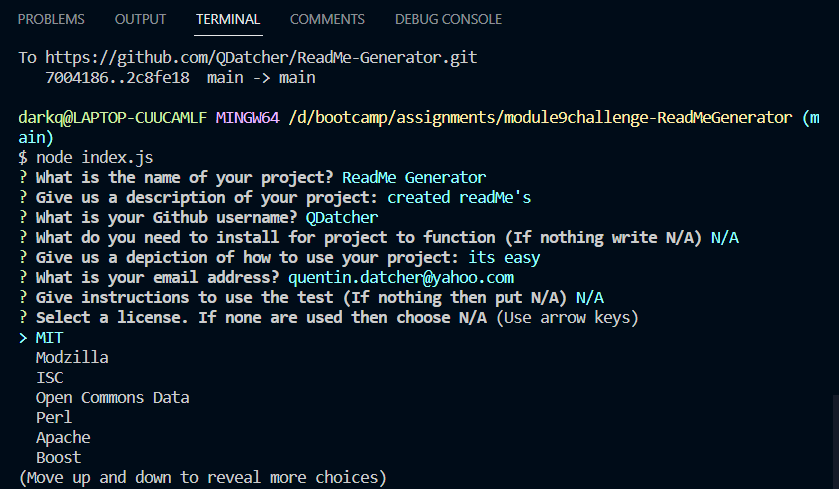
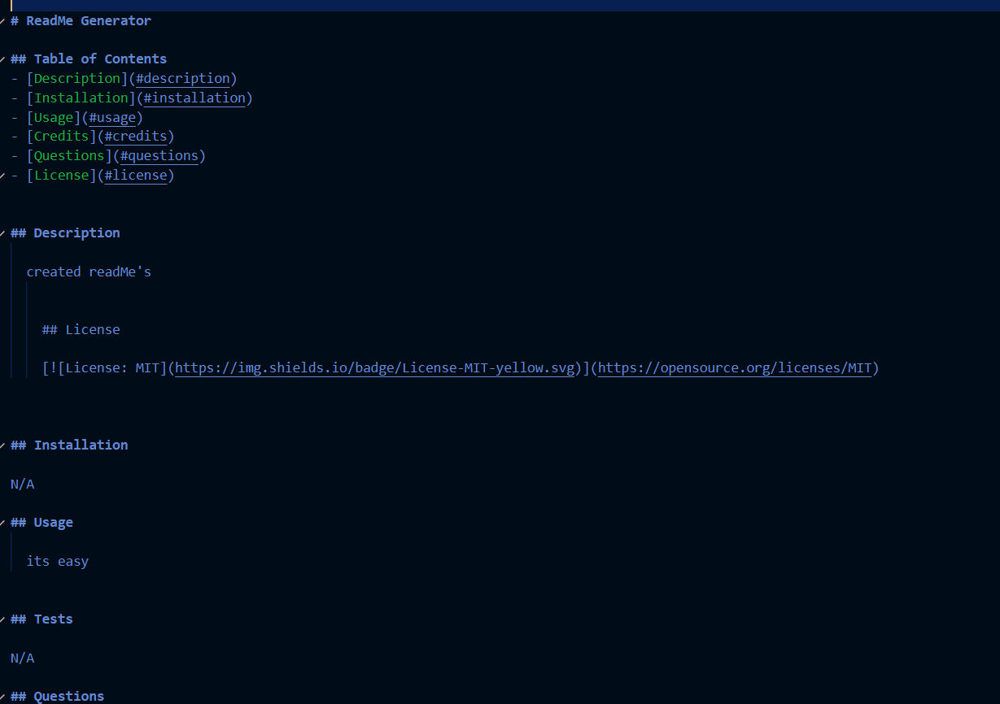

# ReadMe Generator

## Description

This will create a readMe by taking user input in the terminal and generating a readMe file in the folder. 

## Usage

Once you have these you can do node index.js in the terminal where you will face aseries of prompts pertaining to the info your readMe will be composed of including one that asks you to select a license from a list

Once you finish the filling out the info, a readMe will be generated in the folder with your inputs

## Instillation

To use this you have to download node.js and install inquirer@8.2.4

## Links

    -Github Repo: https://github.com/QDatcher/ReadMe-Generator